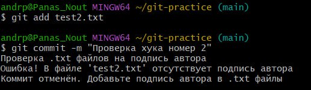
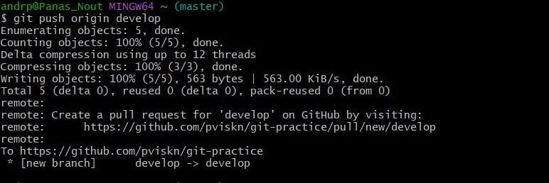

# Панас Анастасия Андреевна, группа K3162, номер ИСУ 467006
## Задание 1


1) Открываем папку _.git/hooks_ , создаем файл _pre-commit_ и выдаем ему права на исполнение

```
$cd .git/hooks
$touch pre-commit
$chmod +x pre-commit
```


2) Пишем bash-скрипт для проверки txt файлов


## Bash-скрипт
Давайте рассмотрим за что отвечают флаги и строки кода в файле _pre-commit_

Вывод на экран строки, информирующей пользователя о начале проверки файлов
```
echo "Проверка .txt файлов на подпись автора"

```

Устанавливается флаг ошибки равный 0, то есть сперва ошибки нет

```
error_flag=0
```
В переменную подается список файлов, которые добавлены в индекс
>ACM: A- добавленные файлы; C- скопированные файлы; M- Измененные файлы

>grep фильтрует файлы, чтобы они были формата txt

```
txt_files=$(git diff --cached --name-only --diff-filter=ACM | grep '\.txt$')
```

Проверка, является ли переменная с файлами пустой, если да, то пользователю выводится текст, информирующий об отсутствии файлов для коммита и выполнение завершается
```
if [ -z "$txt_files" ]; then
    echo "Нет .txt файлов для проверки."
    exit 0
fi
```
Проверка, есть ли файле строка с указанием автора, если есть, то выводится текст о том, что файл прошел проверку, если нет, то значение флага ошибки становится 1
```
for file in $txt_files; do
    if [ -f "$file" ]; then
        # Проверка на наличие текста "Автор:" в файле
        if ! grep -q "Автор:" "$file"; then
            echo "В файле $file отсутствует подпись автора."
            error_flag=1
        else
            echo "Файл $file прошел проверку"
        fi
    fi
done
```

Соответственно, если флаг не равен 0(равен 1), то коммит отменяется, если все файлы удовлетворяют условию, то проверка завершена

-----------------------

3) Создаем 2 текстовых файла 

- test1.txt:


- test2.txt:


4) Выполняем проверку файла с подписью автора


В терминале отобразился текст о том, что все выполнено успешно и запустился коммит

5) Теперь запускаем проверку файла без подписи



Коммит не был запущен и было выведено предупреждение о том, что в файле отсутствует подписью

Также можно повторно запустить коммит файла без подписи с флагом *--no-verify*, то есть без проверки, в таком случае коммит будет запущен


## Задание 2

1) Выполнила проверку версии git flow тем самым проверила наличие


2) Создала новую ветку

> git flow feature start task-management

3) Создала файл _task_manager.py_


4) Выполнила коммит, завершила фичу и объединила ее с основной веткой


5) Переключилась на ветку develop, начала создание релиза, внесла изменения, обновив версию в файле, завершила релиз объединив ветки develop и master


6) Создала hotfix, внесла изменения в файл error.py и выполнила коммит 


7) Завершила hotfix

>git flow hotfix finish hotfix-1.0.1

8) Завершила работу и отправила все изменения на удаленный репозиторий 


